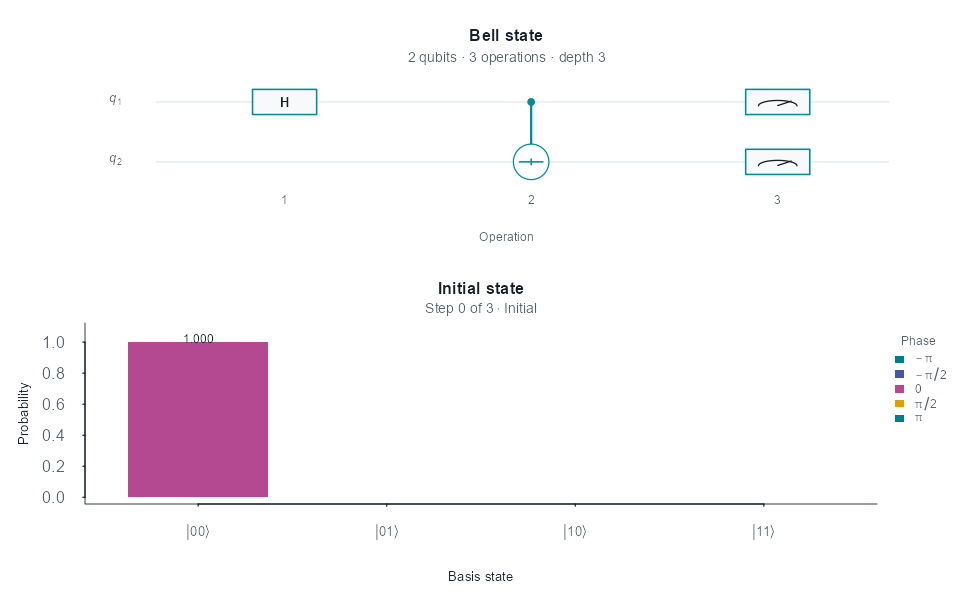
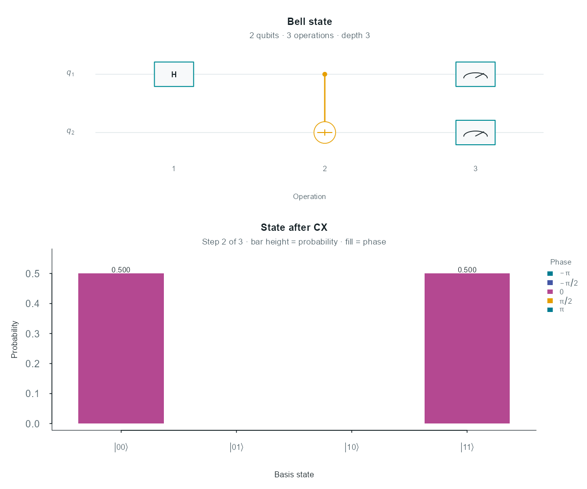
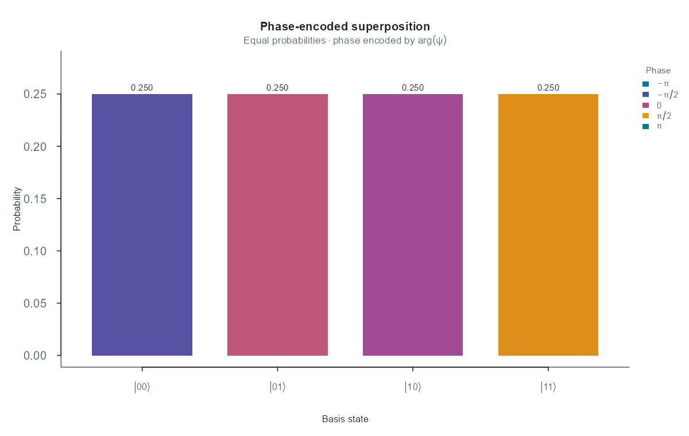
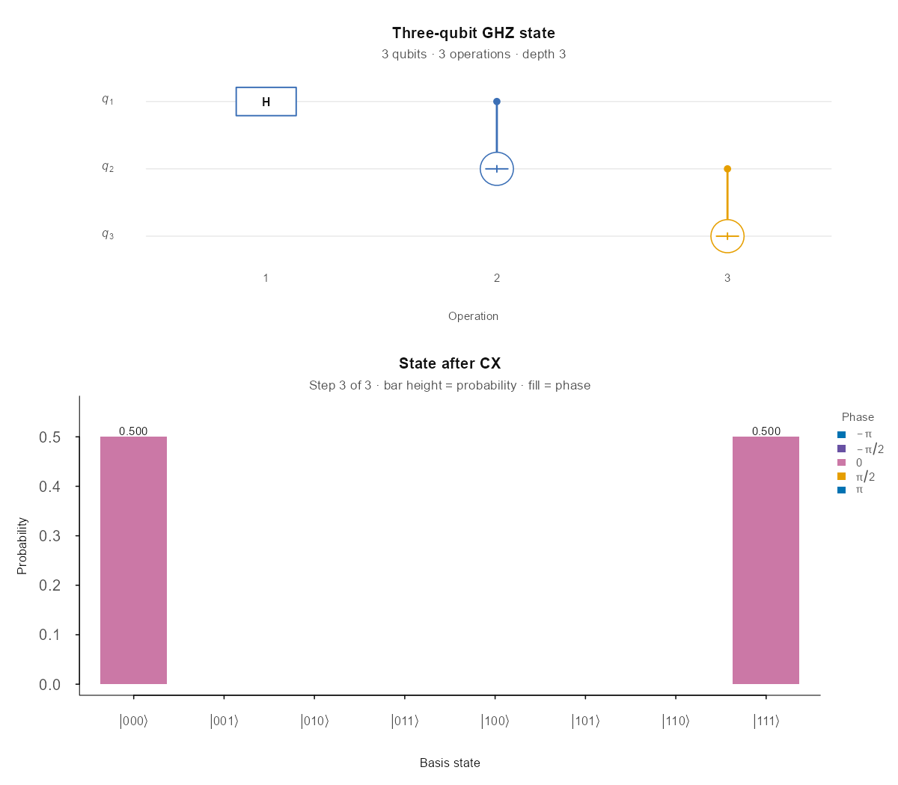
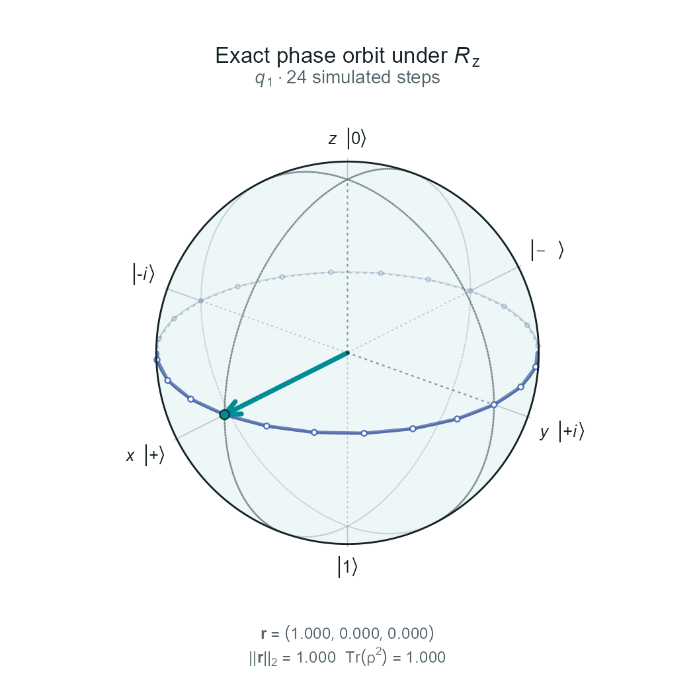
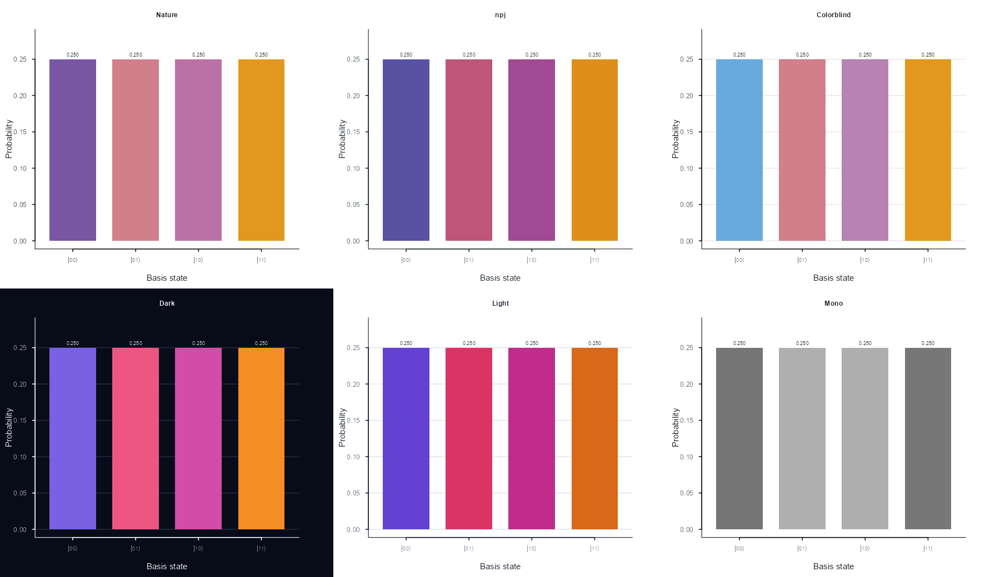
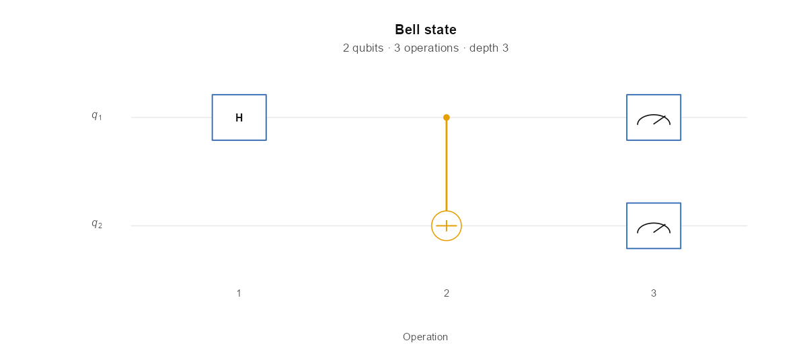
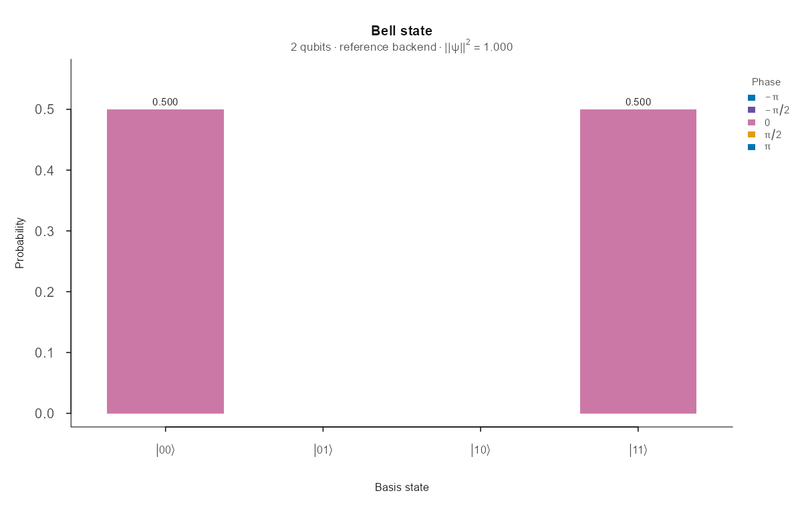
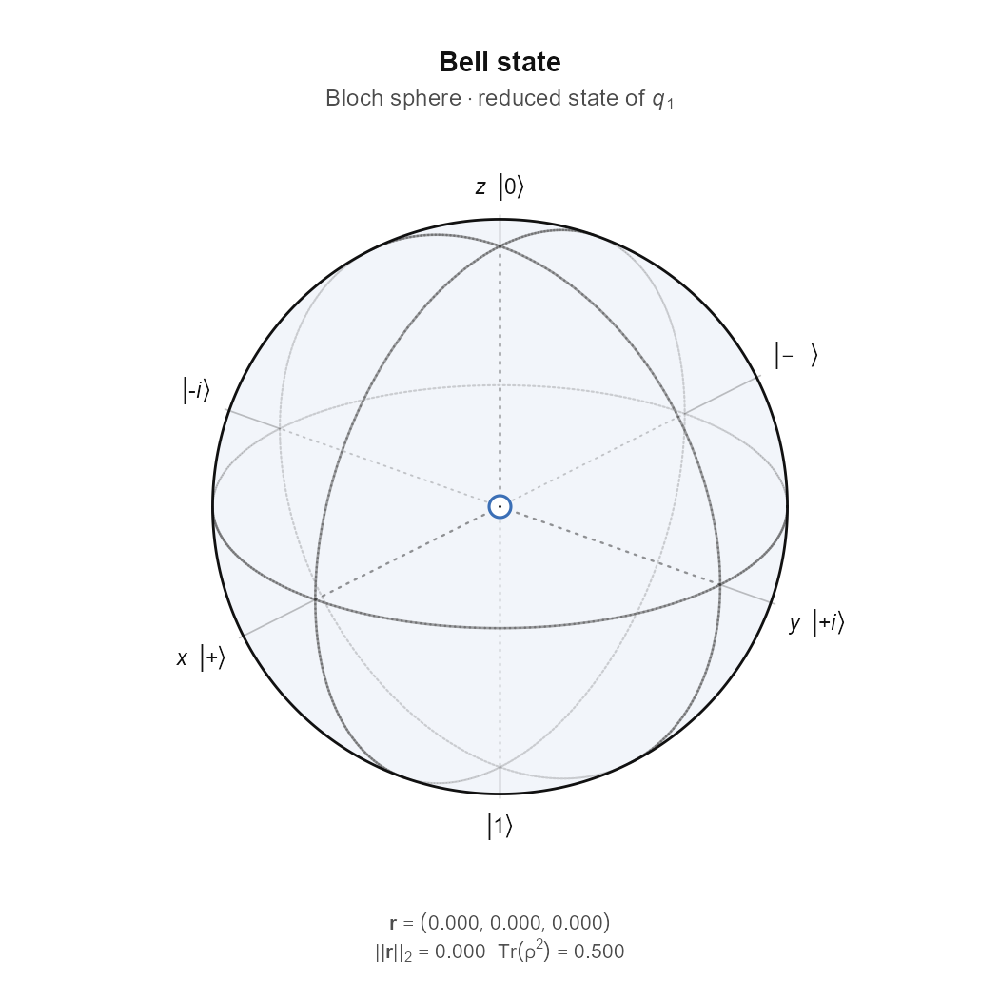
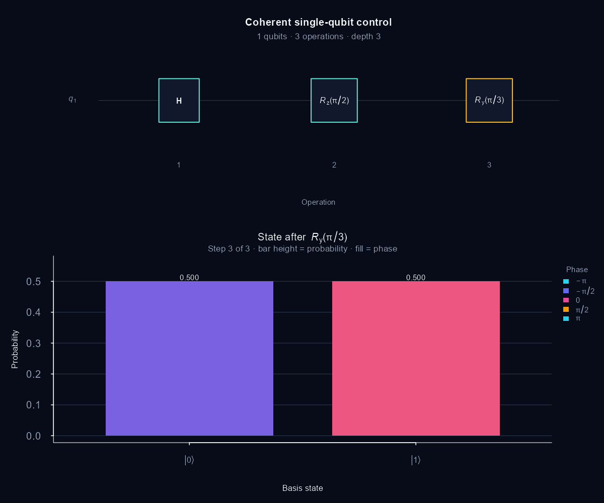

# qvivid

[](https://github.com/SanmiAndreSofa/qvivid/actions/workflows/R-CMD-check.yaml)
[](https://www.r-project.org/)
[](LICENSE.md)

**Quantum simulation you can see.**

Exact statevector circuits, native C amplitude kernels, reproducible sampling,
and publication-ready quantum graphics—built for R.

`qvivid` keeps circuit construction, simulation, tidy inspection, static
figures, and animated trajectories in one R-native workflow. Qubits use
familiar one-based indexing, and the lightweight simulation core does not
require Python.

<p align="center">
  
</p>

## Available today

| Layer | Included in qvivid 0.1.0 |
|---|---|
| Circuits | H, X, Y, Z, S, T, Rx, Ry, Rz, CX, CZ, SWAP, terminal measurement mapping, and custom one- or two-qubit unitaries |
| Simulation | Exact statevectors, readable reference backend, compiled C kernels, seeded shot sampling, and gate-by-gate recording |
| Inspection | Tidy amplitudes, probabilities, phases, counts, trajectories, reduced Bloch vectors, radii, and purities |
| Figures | Circuit, state, synchronized execution, Bloch-sphere, and Bloch-trajectory views |
| Motion | State-evolution and Bloch-trajectory GIFs with fixed axes, camera, basis order, and typography |
| Output | PDF, SVG, PNG, and TIFF; 89 mm and 183 mm journal-width presets; six visual themes |

## Installation

Install the current development version from GitHub:

```r
install.packages("remotes")
remotes::install_github("SanmiAndreSofa/qvivid")
```

The GitHub version installs from source and compiles C. Windows source installs
therefore require the version of
[Rtools](https://cran.r-project.org/bin/windows/Rtools/) compatible with your R
installation. `ggplot2` and `ragg` optionally enhance plotting and raster
output. `gifski` is optional for the core package but required for GIF export.

Measurement currently means terminal measurement with final-shot sampling;
mid-circuit collapse, reset, and conditional operations remain on the roadmap.

## A Bell state in 60 seconds

```r
library(qvivid)

bell <- quantum_circuit(2, name = "Bell state") |>
  gate_h(1) |>
  gate_cx(control = 1, target = 2) |>
  measure_all()

result <- simulate_quantum(
  bell,
  shots = 1000,
  seed = 42,
  record = TRUE
)

result
plot_execution(result, step = 2, theme = "npj")
```



The bar height is probability. Fill color is the complex phase
`arg(ψ)`. Because the circuit was recorded, the circuit playhead and exact state
come from the same execution step.

## Visualization gallery

<table>
<tr>
<td width="50%">
  
  <br><strong>See complex phase</strong><br>
  Probability and phase remain separate, explicitly labelled encodings.
</td>
<td width="50%">
  
  <br><strong>Follow multi-qubit execution</strong><br>
  Circuit operations and exact state evolution share one playhead.
</td>
</tr>
<tr>
<td width="50%">
  <a href="docs/gallery/bloch-orbit.gif">
    
  </a>
  <br><strong>Animate exact trajectories</strong><br>
  The preview links to the full animation.
</td>
<td width="50%">
  
  <br><strong>Choose a visual system</strong><br>
  Nature-inspired, npj-inspired, colorblind, dark, light, and mono.
</td>
</tr>
</table>

The plotting functions use consistent notation and typography. Dirac kets and
Greek symbols are typeset mathematically, Bloch labels avoid collisions, gate
labels remain inside their boxes, and animation frames keep a fixed layout.
Static figures and animations use font sizes suited to the selected device.

## Phase-aware state plots

```r
phase_circuit <- quantum_circuit(2, name = "Phase-encoded superposition") |>
  gate_h(1) |>
  gate_h(2) |>
  gate_rz(1, pi / 2) |>
  gate_rz(2, pi / 3)

phase_result <- simulate_quantum(phase_circuit)
plot_state(
  phase_result,
  theme = "npj",
  engine = "base",
  subtitle = expression(
    "Equal probabilities" %.% "phase encoded by" ~ arg(psi)
  )
)
```

The phase scale is cyclic: `−π` and `π` meet at the same color. The palettes
avoid rainbow encoding; probability remains readable without color, while phase
is identified through an explicit labelled color scale. The mono preset uses
grayscale with an explicit phase legend; additional non-color phase annotations
are planned.

## Exact Bloch trajectories

```r
orbit <- quantum_circuit(1, name = "Exact phase orbit")

for (step in seq_len(24)) {
  orbit <- gate_rz(orbit, 1, 2 * pi / 24)
}

orbit_result <- simulate_quantum(
  orbit,
  initial_state = c(1, 1) / sqrt(2),
  record = TRUE
)

install.packages("gifski") # once, if GIF export is not installed

animate_bloch(
  orbit_result,
  "phase-orbit.gif",
  qubit = 1,
  fps = 8,
  theme = "npj"
)
```

For a qubit entangled with the rest of a register, `bloch_vector()` computes the
reduced state directly. Its radius contracts inside the sphere, and the figure
reports the vector norm and purity as `Tr(ρ²)`.

## Publication export

```r
save_quantum_plot(
  result,
  "bell-execution.pdf",
  view = "execution",
  size = "double",
  theme = "nature"
)
```

`size = "single"` and `size = "double"` use 89 mm and 183 mm widths.
PDF and SVG preserve vector geometry; individual devices or font stacks may
convert text to vector outlines. PNG and TIFF default to 450 dpi. The `nature`
and `npj` names describe publication-oriented visual intentions, not official or
endorsed journal palettes.

## Simulation performance

Routine gates update amplitude pairs or quartets directly without constructing
a full `2^n × 2^n` system matrix. The readable R backend is used to verify the
compiled backend, and both return the same result structure.

Before allocation, `simulate_quantum()` estimates the state, working space,
probability, sampling, and recorded-trajectory footprint. The default 2 GiB
guard stops an unsafe request with a component-level estimate; users can raise
`memory_limit_gib` explicitly after confirming that the machine has capacity.

See [docs/PERFORMANCE.md](docs/PERFORMANCE.md) for benchmarks and implementation
notes, and [docs/ROADMAP.md](docs/ROADMAP.md) for planned backends.

## Indexing and reproducibility

Qubits are one-based in the R API. Internally, qubit 1 is the least-significant
statevector bit. Displayed basis labels follow conventional high-to-low order,
so a two-qubit Bell state appears at `|00⟩` and `|11⟩`.

Shot sampling accepts an explicit seed, and recorded trajectories retain the
exact state after every operation. The package test suite covers normalization,
endianness, canonical Bloch directions, Bell and GHZ behavior, seeded counts,
visual geometry, notation, compact devices, and animation scaffold stability.

## API stability

The public API documented for `qvivid` 0.1.x will remain compatible throughout
the series. This includes exported functions and their required arguments, S3
classes, one-based/LSB basis semantics, and the documented circuit, result,
count, state-data, and trajectory structures. Minor releases may add optional
arguments, functions, fields, or columns, so downstream code should select
named values rather than depend on list position.

If an interface must be replaced, it will warn for at least one 0.1.x release
and remain usable through the 0.1.x series; removal can occur no earlier than
0.2.0. Serious correctness or security defects are the only exception and will
be identified in `NEWS.md`. Unexported `.qv_*` names, exact timing values,
warning wording, and pixel-level plot geometry are implementation details.
See the Getting Started vignette for complete schema documentation.

Plot behavior is deterministic across installations: `plot_state()` uses base
graphics by default and returns its plotted data invisibly. `engine = "auto"`
is a compatibility alias for base graphics. Only an explicit
`engine = "ggplot2"` requires `ggplot2` and returns a ggplot object.

## Documentation

- [Getting started and 0.1.x compatibility](vignettes/getting-started.Rmd)
- [Product vision](docs/PRODUCT_VISION.md)
- [Architecture](docs/ARCHITECTURE.md)
- [Performance engineering](docs/PERFORMANCE.md)
- [Visual style and export policy](docs/VISUAL_STYLE.md)
- [R quantum-package landscape](docs/r-quantum-package-landscape.md)
- [Long-term roadmap](docs/ROADMAP.md)

## More rendered samples

<table>
<tr>
<td width="50%">
  
  <br><strong>Circuit layout</strong><br>
  Compact gates, measurement glyphs, and an explicit operation axis.
</td>
<td width="50%">
  
  <br><strong>State inspection</strong><br>
  Exact probabilities, Dirac basis labels, and a reserved phase legend.
</td>
</tr>
<tr>
<td width="50%">
  <a href="docs/gallery/bell-bloch.gif">
    
  </a>
  <br><strong>Reduced-state geometry</strong><br>
  Entanglement contracts the selected qubit to the sphere center; click for GIF.
</td>
<td width="50%">
  
  <br><strong>Presentation preset</strong><br>
  The dark preset uses the same notation and layout as the light themes.
</td>
</tr>
</table>

## Project status

`qvivid` 0.1.0 is a release candidate that provides the complete simulation and
visualization workflow described above. Its release workflow checks Linux,
macOS, Windows, R-devel, and R 4.2. The documented 0.1.x API and data structures
will remain compatible throughout the series. Noise models, additional
simulation engines, and remote hardware support are planned. Bug reports,
reproducible examples, visual test cases, and performance benchmarks are
welcome.

Released under the [MIT license](LICENSE.md).
