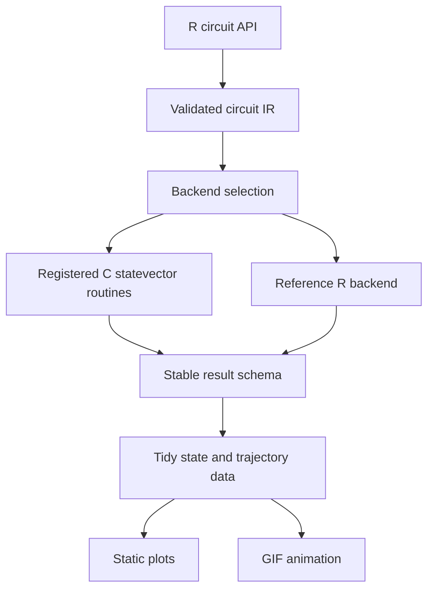

# qvivid architecture

## Layered model

## Circuit contract

A `qv_circuit` stores operations as data. Gate constructors return a modified
circuit and never mutate the global environment. qvivid 0.1.x supports:

- one-based R qubit and classical-bit indices;
- one- and two-qubit unitaries;
- terminal measurement;
- per-operation labels and parameters;
- a schema version for format identification and compatibility checks.

Qubit 1 is the least significant statevector bit. A two-qubit unitary supplied
for `c(q1, q2)` uses the local matrix basis `|00⟩, |01⟩, |10⟩, |11⟩` with `q1`
as the first, locally most-significant qubit. The simulation tests cover this
convention in both qubit orders.

## Backend contract

The public entry point is `simulate_quantum()`. Backends receive a validated
circuit and initial state and return the same `qv_result` fields. qvivid 0.1.x
has two implementations:

- `native`: C kernels registered through R's `.Call` API, with no external
  compiled dependency;
- `reference`: readable vectorized R code used for numerical parity checks.

`backend = "auto"` selects native code in an installed package and falls back
to the reference engine in source-only development sessions.

The native one-qubit kernel updates amplitude pairs in place on a duplicated R
vector. The two-qubit kernel updates amplitude quartets in the declared local
basis. Both use `O(2^n)` time for a gate and `O(2^n)` state memory, without a
full operator matrix. Native routines are declared in `src/init.c`, registered
with `R_registerRoutines()`, and loaded with dynamic symbol lookup disabled.

## Result contract

A `qv_result` contains:

- the originating circuit;
- the final complex statevector;
- a compact exact-probability vector, with tidy labels materialized lazily;
- optional shot counts;
- seed, backend, and elapsed time;
- an optional gate-by-gate trajectory;
- a result schema version.

The documented field names and meanings form the 0.1.x result contract for
both current backends.

## Visualization contract

`state_data()`, `trajectory_data()`, `bloch_vector()`, and
`trajectory_bloch()` are the boundary between numerical and visual code.
Plots and animations do not reach into native memory or re-run a circuit. This
keeps visual behavior deterministic and separates rendering from execution.

The base graphics engine is dependency-free. Optional `ggplot2` output is for
publication composition, while `gifski` encodes trajectory frames.

## Current package boundaries

The public circuit constructors validate and return `qv_circuit` data. The two
simulation backends consume that representation and return the same
`qv_result` schema. Data helpers then convert results into the tabular forms
used by plots and animations.

Custom one- and two-qubit matrices enter through the validated gate API. qvivid
0.1.0 does not expose public backend registration, transpilation, noise-model,
serialization, or remote-provider interfaces. Those capabilities are outside
the current architecture contract.
